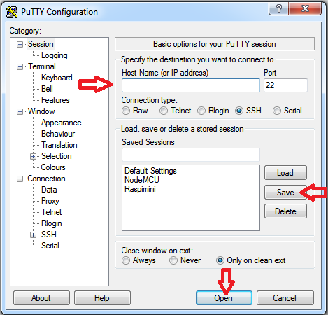
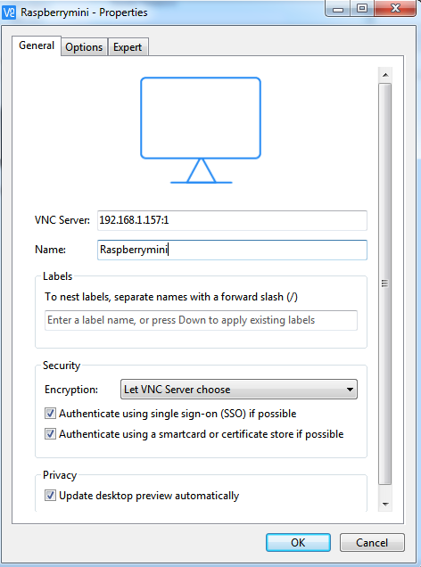

# Connessione in remoto a Raspberry

## Prima connessione

1. Abilitazione SSH su raspberry: 

   ```bash
   sudo raspi-config
   ```

   appuntarsi l'indirizzo IP(ifconfig) e riavviare il raspberry

2. Su computer client scaricare Putty e avviarlo

3. Avviare connessione SSH

   Inserire nella voce Host Name l'indirizzo ip del Raspberry, lasciare porta 22 e la spunta su SSH, se si vuole memorizzare questa connessione prima di cliccare su Open cliccare su Save

   

   Su Linux o Mac si può accedere da remoto con protocollo SSH digitando da terminale:

   ```bash
   ssh pi@<IP Address of your Pi>
   ```

   Inserire il nome utente "pi" e la password del nostro utente, di default è "raspberry"

4. Ora è necessario installare un server VNC(Virtual Network Computing) per la condivisione dello schermo che permette l'accesso da remoto all'interfaccia grafica di un computer quindi installare con

   ```bash
   sudo apt-get install tightvncserver
   ```

   Dare conferma con la "Y" quando richiesto

5. Avviare il server digitando:

   ```bash
   tightvncserver
   ```

   verrà chiasto di impostare la password, la risposta sarà:

   ```
   New ‘X’ desktop is raspberrypi:1
   ```

   se si vuole creare un collegamento con dimensioni della finestra maggiori:

   ```bash
   vncserver :2 -geometry 1920x1080 -depth 24
   ```

6. Adesso è necessario scaricare un client VNC

   Vnc Viewer by Real VNC è una buona scelta, una volta scaricato creare una nuova connessione inserendo il numero IP del Raspberry seguito da : e il numero del server scelto (1 default 2 nel caso si sia creata la connessione Full-HD)

   

7. Quando ci si connette inserire la password settata al punto 5 e dare ok

## Connessioni successive

1. Accendere il Raspberry e lasciare che si connetta

2. Effettuare la connessione con Putty come da punto 3, inserire "pi" come nome utente e la password relativa all'utente "pi", di defalut è "raspberry"

3. avviare il server vnc 

   ```
   tightvncserver
   ```

   oppure la versione full hd come mostrato prima

4. Sul cliente avviare il VNC client e selezionare la connessione impostata prima

5. Inserire la password impostata della connessione VNC

Nel caso si voglia chiudere la connessione al server VNC, dal terminale aperto di putty digitare:

```bash
vncserver -kill
```

